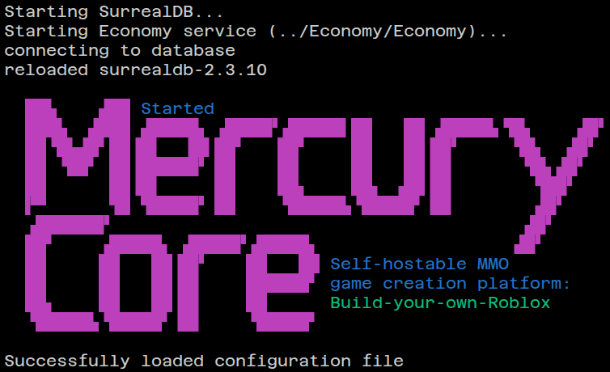

This page provides information about the Site service in Mercury Core, including its functionality, features, and how it integrates with other services.

## Startup

A development server can be started with `bun dev`. This will start the server in development mode (by default on port 5173), enabling features like hot-reloading for easier development. For a production preview, run `bun run build` followed by `bun preview` (or both at once by using `bun run buildview`). This will start a production preview server (by default on port 4173). The ports for these services will automatically increment by 1 if the default ports are already in use until a free port is found. The development server starting on an unexpected port is an indication that there is probably already a development server running, and you may wish to stop it before starting a new one.

For a full production deployment, run `bun run build` followed by `bun -b ./build`. The server will be started on the port specified in your **.env** file. We use port 4443, and if not specified the default is 3000, though this can be changed to any port you wish.

On successful startup, the Site will display output similar to the following:

```
Starting SurrealDB...
Starting Economy service (../Economy/Economy)...
connecting to database
reloaded surrealdb-3.0.1

  ██▙    ▟██ Started
  ███▙  ▟███ ▟████▙ ▗████▛▗█████▌██   ██ ▟████▙▝█▙    ▗█▛
  ██▝█▙▟█▘██▐█▌  ▐█▌██▘   ██▘    ██   ██▐█▛     ▝█▙  ▗█▛
  ██ ▝██▘ ██▐█████▛ ██    ██     ██   ██▐█▌      ▝█▙▗█▛
  ██      ██▐█▌     ██    ██▖    ██▖ ▗██▐█▌       ▝██▛
  ▛▀      ▜█ ▜████▛ ██    ▝█████▙▝█████▘▐█▌       ▗█▛
  ▗██████▛                                       ▗█▛
  ██▘    ▗█████▖ ▟████▛▗█████▖                  ▗█▛
  ██     ██   ██▐█▛    ██   ██ Self-hostable MMO
  ██     ██   ██▐█▌    ██████▘ game creation platform:
  ██▖    ██   ██▐█▌    ██      Build-your-own-Roblox
  ▝█████▙▝█████▘▐█▌    ▝█████▘

Successfully loaded configuration file
```


